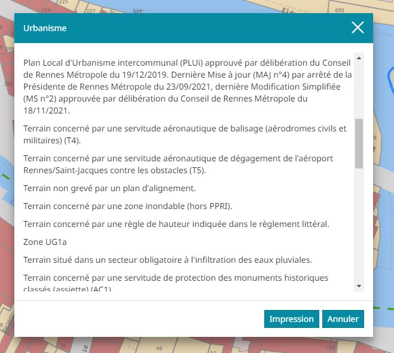

# Prise en main rapide

## Activer la boîte à outils "Urbanisme"

Elle s'active depuis la  barre de fonctionalités  en cliquant sur l'icône urbanisme  présente dans l'interface de mapstore

* soit dans la side bar  (version 2022.xx)

*

* soit dans le burger menu (version 2021.xx)

*

## Créer la note de renseignement d'urbanisme d'une parcelle

* activer la fonction de création de la note de renseignement d'urbanisme en cliquant sur le 1er bouton dela boite à outils : 
* 
*

* cliquer sur la carte sur la parcelle à interroger : la note de renseignement d'urbanisme est créée pour cette parcelle avec le renseignement des informations liées à la parcelle (informations cadastrales):

*

et les informations liées à l'urbanisme (PLUi) :

*

Un ascenceur permet de parcourir la fiche complète avec l'ensemble des informations liées à cette parcelle.

**Les informations casdastrales sont issues de l'outil  "cadastrapp" (interrogation avancée du cadastre) de geOrchestra, par conséquent les informations nominatives affichées suivent les droits attribués à l'utilisateur dans cette application.**

**Un utilisateur anonyme ou avec peu de droit ne verra pas le nom du propriétaire et la référence du compte cadastral de la parcelle interrogée (cas de l'exemple ci-dessus).** 
## Imprimer la note de renseignement d'urbanisme
* cliquer sur le bouton "Urbanisme"
* 
## Créer la liste des dossiers de Ddroit des Sols sur une parcelle