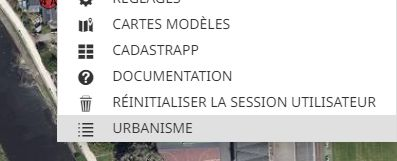
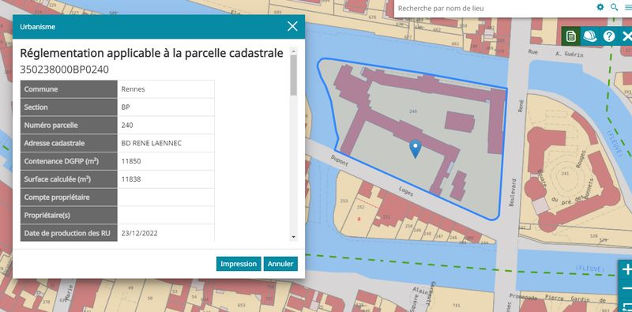
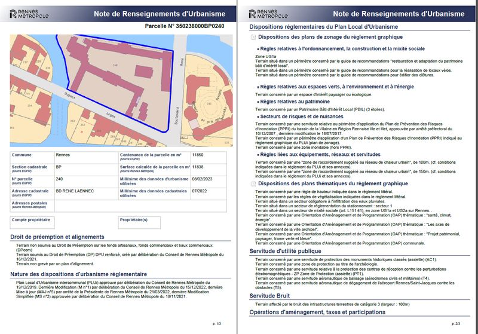
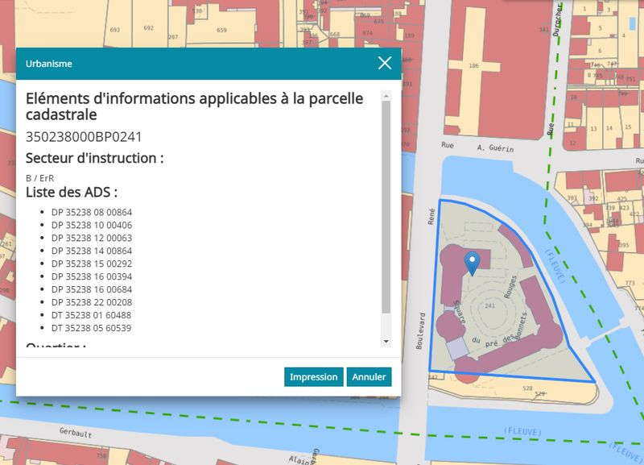
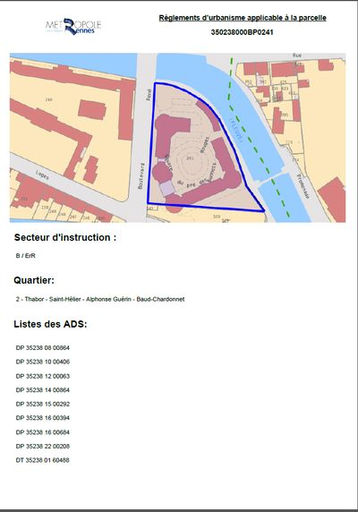
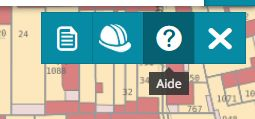

# Prendre en main
## Activer la boîte à outils "Urbanisme"

Elle s'active depuis la  barre de fonctionalités  en cliquant sur l'icône urbanisme  présente dans l'interface de mapstore

* soit dans la side bar  (version 2022.xx)

* soit dans le burger menu (version 2021.xx)

## La note de renseignement d'urbanisme(NRU) d'une parcelle cadastrale

### La créer

* activer la fonction de création de la note de renseignement d'urbanisme en cliquant sur le 1er bouton de la boite à outils (le bouton change de couleur et passe en vert, indiquant ainsi qu'il est actif) : 
 

* cliquer dans la carte sur la parcelle à interroger : la note de renseignement d'urbanisme est créée pour cette parcelle avec le renseignement des informations liées à la parcelle (informations cadastrales):

et les informations liées à l'urbanisme (PLUi) :

Un ascenceur permet de parcourir la fiche complète avec l'ensemble des informations liées à cette parcelle.

**Les informations casdastrales sont issues de l'outil "cadastrapp" (interrogation avancée du cadastre) de geOrchestra, par conséquent les informations nominatives affichées suivent les droits attribués à l'utilisateur dans cette application.**

**Un utilisateur anonyme ou avec peu de droit ne verra pas le nom du propriétaire et la référence du compte cadastral de la parcelle interrogée (cas de l'exemple ci-dessus).** 

### L'imprimer

* cliquer sur le bouton "Impression" : un fichier pdf reprenant toutes les informations de la parcelle est généré automatiquement et téléchargé, il est alors possible de l'imprimer si nécessaire.

### Fermer la fonctionnalité

En cliquant sur la croix en haut à droite de la NRU

## La liste des dossiers d'Autorisation de Droit des Sols (ADS: permis de contruire, permis de démolir...) d'une parcelle cadastrale
### La créer

* activer la fonction de création de la liste des dossiers d'ADS en cliquant sur le 2ème bouton de la boite à outils (le bouton change de couleur et passe en vert, indiquant ainsi qu'il est actif) : 
 

* cliquer dans la carte sur la parcelle à interroger : la liste des dossiers d'ADS est créée pour cette parcelle: 

Un ascenceur permet de parcourir la fiche complète avec l'ensemble des informations liées à cette parcelle.

### L'imprimer

* cliquer sur le bouton "Impression" : un fichier pdf reprenant toutes les informations de la parcelle est généré automatiquement et téléchargé, il est alors possible de l'imprimer si nécessaire.

### Fermer la fonctionnalité

En cliquant sur la croix en haut à droite de la liste

## Accéder à cette documentation

* cliquer sur le bouton d'aide :

## Fermer le plugin

* cliquer sur la croix :

